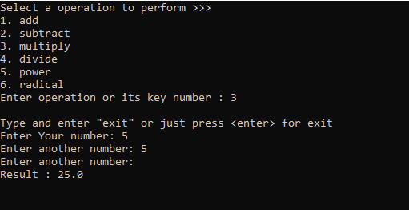

<table>
  <tr>
    <td>
      
    </td>
    <td>
      <h2>Simple Calculator in Python</h2>
      
A simple calculator model in Python terminal

      
Contains: 1. add 2. subtract 3. multiply 4. divide 5. power 6. radical

    </td>
  </tr>
</table>

---

### Preview Screenshots:

<table align="center">
  <tr>
    <td></td>
  </tr>
</table>
